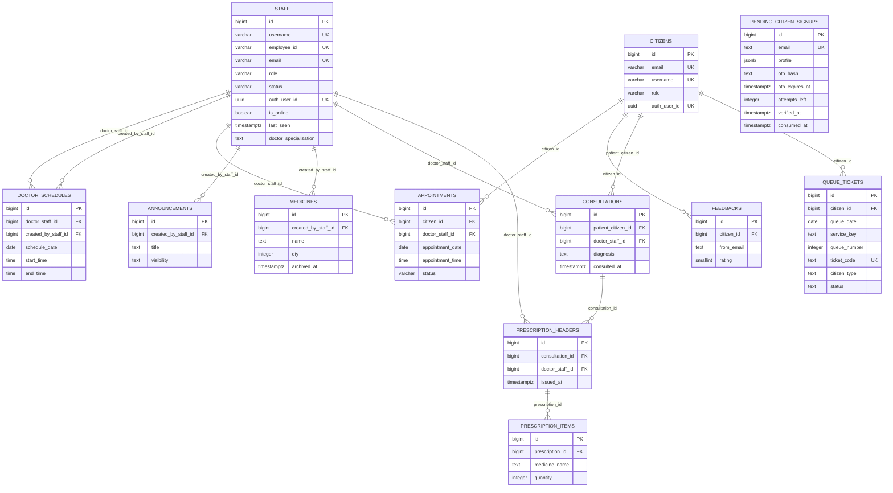

# UKonek ER Diagram

Last updated: 2026-04-05

## Notes

- This ERD models current active tables only.
- Historical tables removed by migrations are intentionally omitted.
- Auth users live in Supabase auth schema and are linked by `auth_user_id` in `staff` and `citizens`.
