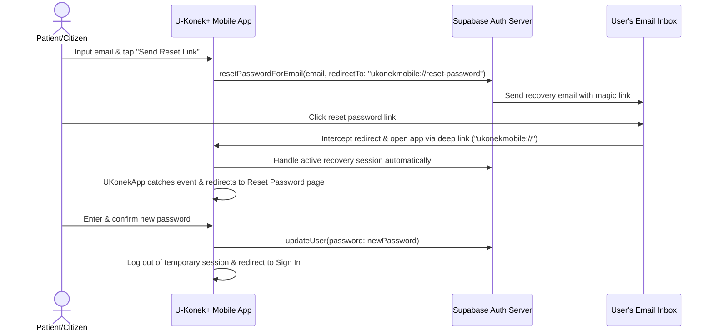

# Mobile Password Reset & Recovery Implementation Guide

This guide outlines how the **Forgot Password** and **Reset Password** flow is now implemented in the U-Konek+ mobile application, and provides step-by-step instructions for completing the configuration in the **Supabase Dashboard**.

---

## 1. How the Flow Works Under the Hood

Because legacy OTP-based password resets are deprecated in Supabase, we transitioned the mobile app to use **Supabase Native Email Recovery Links + Deep Linking**:



1. **Request Reset**: The citizen inputs their email in the **Forgot Password** screen (`uKonekForgotPasswordPage.dart`).
2. **Email Delivery**: The app triggers `ApiService.requestPasswordReset()`, which passes the redirect parameter `redirectTo: "ukonekmobile://reset-password"`. Supabase sends an email containing a secure token.
3. **App Interception**: When the user clicks the link in the email, the operating system redirects the link into the application using the registered `ukonekmobile` URL scheme.
4. **Active Session Detection**: The `supabase_flutter` package parses the session token from the deep link, logs the user into a temporary recovery session, and fires an `AuthChangeEvent.passwordRecovery` event.
5. **Redirection to Change Password**: The app's global auth state listener in `main.dart` intercepts this event and navigates the user directly to the new `uKonekChangePasswordPage.dart`.
6. **Password Update**: The user specifies their new password. The app updates the password in Supabase via `_client.auth.updateUser()` and routes them back to the login page to sign in cleanly.

---

## 2. Code Changes Made

We updated four files to complete the implementation:

### A. Mobile API Service ([api_service.dart](file:///c:/UKonekSupabase/frontend/mobile/ukonekmobile/lib/services/api_service.dart))
* Configured `requestPasswordReset` to send the `redirectTo` query parameter so Supabase knows to route back to `ukonekmobile://reset-password` on mobile.
* Refactored `resetCitizenPassword` to securely call Supabase's `updateUser` with the new password, taking advantage of the active recovery session.

### B. Global App Entry & Deep Link Listener ([main.dart](file:///c:/UKonekSupabase/frontend/mobile/ukonekmobile/lib/main.dart))
* Converted `UKonekApp` to a `StatefulWidget` to maintain a persistent listener across the entire lifecycle.
* Subscribed to `onAuthStateChange` to monitor for `AuthChangeEvent.passwordRecovery` and immediately navigate to `uKonekChangePasswordPage` using the global `navigatorKey` (preventing context/navigation errors).

### C. Change Password Screen ([uKonekChangePasswordPage.dart](file:///c:/UKonekSupabase/frontend/mobile/ukonekmobile/lib/uKonekChangePasswordPage.dart))
* Rewrote the page to remove legacy OTP parameters.
* Aligned the UI, buttons, fields, and cards with the new premium **Medical Green** theme tokens (`_primary`, `_primary2`, `_bg`, `_textDark`, `_textMuted`, `_fieldBdr`).
* Integrated a real-time password strength meter and verification rules.

### D. Platform Deep Link Configurations
* **Android ([AndroidManifest.xml](file:///c:/UKonekSupabase/frontend/mobile/ukonekmobile/android/app/src/main/AndroidManifest.xml))**: Added an `<intent-filter>` to register the `ukonekmobile` custom URL scheme under `MainActivity`.
* **iOS ([Info.plist](file:///c:/UKonekSupabase/frontend/mobile/ukonekmobile/ios/Runner/Info.plist))**: Added `CFBundleURLTypes` registering the `ukonekmobile` URL scheme.

---

## 3. Required Supabase Dashboard Settings (CRITICAL ⚠️)

To make deep linking work, you **MUST** configure the redirect URI inside your Supabase Project Settings:

1. Go to the **[Supabase Dashboard](https://supabase.com/dashboard)**.
2. Select your project (**dqjxpwbsbzagbjtulhue**).
3. Navigate to **Authentication** (left sidebar) -> **URL Configuration**.
4. In the **Redirect URLs** section, click **Add URL**.
5. Add the following redirect URL:
   ```text
   ukonekmobile://reset-password
   ```
6. Click **Save**.

> [!WARNING]
> If you omit this step, Supabase will block the deep link redirection for security reasons and fall back to the default site URL (usually a generic web portal), which will break the mobile app redirection.

---

## 4. How to Test the Flow

1. Open the mobile app on a real device or emulator.
2. Navigate to **Sign In** -> click **Forgot Password?**.
3. Enter a registered citizen's email and tap **SEND RESET LINK**.
4. Check your email on the same testing device.
5. Open the email from Supabase and tap the **Reset Password** link.
6. The app will immediately launch and route you directly to the **Reset Password** page.
7. Enter your new password and tap **SAVE NEW PASSWORD**.
8. Sign in using your new credentials!
